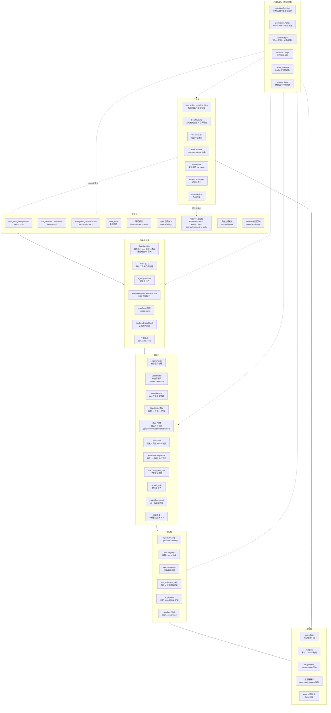
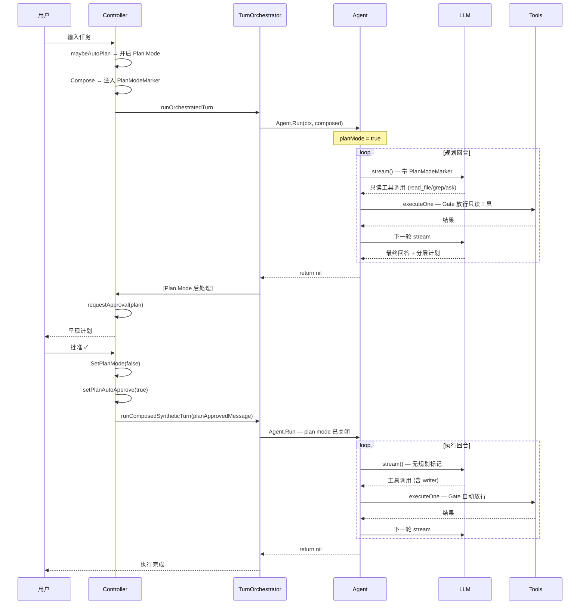
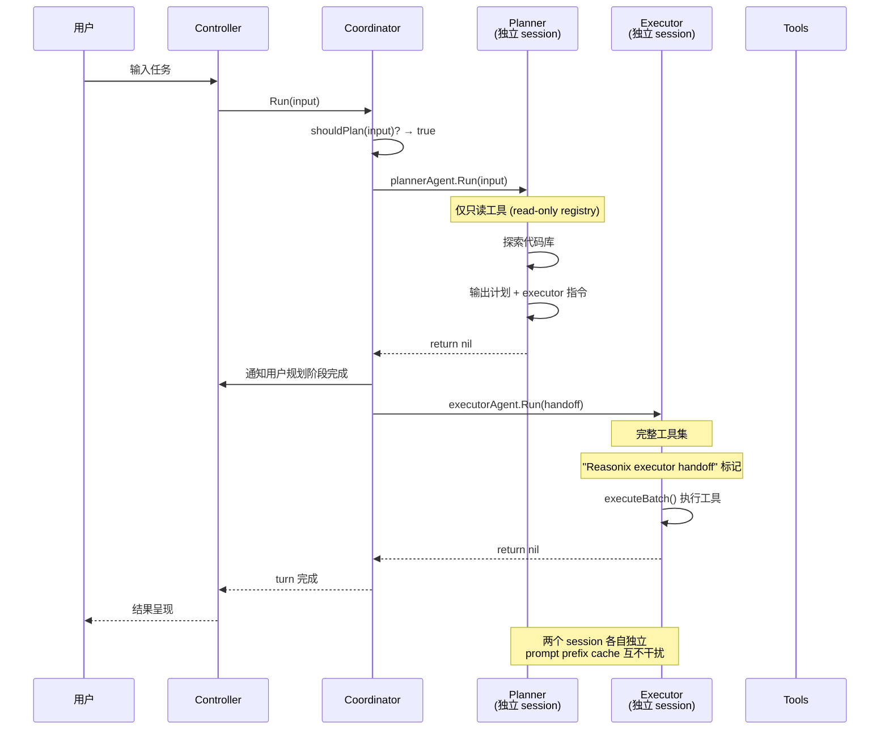
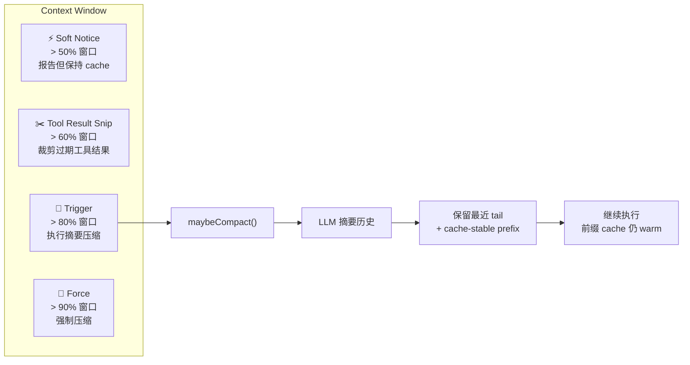

# Reasonix 智能体编排架构总览

> 使用 VSCode 或 Markdown Preview Enhanced 渲染 Mermaid 图表。

---

## 1. 整体架构：七层映射



---

## 2. 主流程：Agent Run 循环

```mermaid
flowchart TB
    Start([用户输入]) --> C{Controller.Compose}
    C -->|注入| RL["<reasoning-language> 块"]
    C -->|注入| MU["<memory-update> 块<br/>turn-tail 笔记"]
    C -->|注入| BJ["<background-jobs> 块<br/>后台作业完成通知"]
    C -->|注入| PM["Plan Mode 标记"]
    C -->|注入| AG["<active-goal> 块"]
    C --> Composed[已编译输入]

    Composed --> TC{TurnOrchestrator}
    TC -->|检查| AutoPlan["shouldAutoPlan?<br/>→ 自动开启 Plan Mode"]
    TC -->|首次| SessionStart["maybeSessionStart<br/>会话启动 hook"]
    TC --> AgentRun["Agent.Run(ctx, input)"]

    subgraph AgentRunLoop["Agent.Run() 主循环"]
        direction TB
        Step0["0. 追加用户消息到 session"]
        Step0 --> Step1

        subgraph Loop["for step := 0; step < maxSteps; step++"]
            Step1["1. stream() → LLM"]
            Step1 --> Step2{结果类型}

            Step2 -->|ChunkReasoning| Reasoning["发射 reasoning 事件"]
            Step2 -->|ChunkText| Text["发射 text 事件"]
            Step2 -->|ChunkToolCall| ToolCalls["收集工具调用"]
            Step2 -->|ChunkUsage| Usage["记录 token 用量<br/>缓存命中状态"]
            Step2 -->|中断| StreamRecovery["重试最多 3 次"]

            ToolCalls --> Step3["3. 追加 assistant 消息到 session<br/>含 reasoning + text + tool_calls"]
            Step3 --> Step4{有工具调用?}

            Step4 -->|无| FinalCheck["finalReadinessCheck"]
            FinalCheck -->|就绪| Return["return nil<br/>turn 完成"]
            FinalCheck -->|就绪失败| RetryReadiness["重试最多 3 次"]

            Step4 -->|有| ExecuteBatch["4. executeBatch()"]
            ExecuteBatch --> Partition["分区并行/串行执行"]
            Partition --> ExecuteOne["executeOne()"]
            ExecuteOne --> Results["工具结果追加到 session"]
            Results --> Compact["5. maybeCompact()<br/>>80% 窗口 → 摘要压缩"]
            Compact --> Loop
        end

        Loop -->|grace round| Grace["超限后一轮 grace<br/>只输出最终回答"]
    end

    AgentRun --> TurnDone{Turn 后处理}

    TurnDone -->|Plan Mode| PlanApproval{"用户审批"}
    PlanApproval -->|批准| PlanExec["关闭 Plan Mode<br/>→ 合成 turn 自动执行"]
    PlanApproval -->|拒绝| StayPlan["保持 Plan Mode<br/>继续规划"]
    PlanExec --> StayPlan

    TurnDone -->|Goal Mode| GoalCheck{"解析末尾标记"}
    GoalCheck -->|[goal:continue]| GoalContinue["自动注入合成 turn"]
    GoalCheck -->|[goal:complete]| GoalEnd["结束目标"]
    GoalCheck -->|[goal:blocked]| GoalBlocked["停止并等待用户"]

    GoalContinue --> GoalSelfCheck["质量自检 round"]
    GoalSelfCheck --> GoalEnd

    TurnDone -->|普通| WaitNext[等待下一个用户输入]

    WaitNext --> Start
    GoalContinue --> Start
```

---

## 3. Plan Mode 规划 → 执行流程



---

## 4. 双模型 Coordinator 流程



---

## 5. Goal 目标 FSM

```mermaid
flowchart LR
    Idle[⚪ Idle] -->|用户设置目标| Running[🟢 Running]
    Running -->|模型回答 [goal:continue]| Turn["执行 turn"]
    Turn --> Running
    Running -->|模型回答 [goal:complete]| Complete["🟢 Goal Complete"]
    Complete --> SelfCheck["自动质量自检"]
    SelfCheck -->|通过| Done["✅ Done"]
    SelfCheck -->|发现问题| Fix["修复"]
    Fix -->|模型回答 [goal:continue]| Turn
    Running -->|模型回答 [goal:blocked]| Blocked["🟡 Blocked<br/>等待用户"]
    Blocked -->|用户输入| Running
    Running -->|用户取消 / 超 50 轮| Stopped["🔴 Stopped"]
```

---

## 6. 上下文压缩触发器



---

## 7. 子智能体系统架构

```mermaid
flowchart TB
    MainAgent["主 Agent<br/>Agent.Run()"]

    subgraph TaskTool["task 工具调用"]
        SubAgent["子 Agent<br/>过滤后的 ToolRegistry"]
        SubAgent --> SAInput["子 session + 输入"]
        SAInput --> SARun["子 Agent.Run()"]
        SARun --> SAResult["子结果 → 父工具结果"]
    end

    subgraph ReadOnlyTask["read_only_task 工具调用"]
        ROAgent["只读子 Agent<br/>仅读工具"]
        ROAgent --> RORun["只读研究"]
        RORun --> ROResult["研究结论 → 父工具结果"]
    end

    subgraph ParallelTasks["parallel_tasks 调用"]
        P1["子任务 1<br/>goroutine"]
        P2["子任务 2<br/>goroutine"]
        P3["子任务 3<br/>goroutine"]
        P1 --> Result["并发收集结果"]
        P2 --> Result
        P3 --> Result
    end

    MainAgent -->|task| TaskTool
    MainAgent -->|read_only_task| ReadOnlyTask
    MainAgent -->|parallel_tasks| ParallelTasks

    Note["⚠️ TaskTool 排除递归工具<br/>subagentMetaTools =<br/>task, read_only_task, parallel_tasks,<br/>run_skill, install_skill, ...]
```
